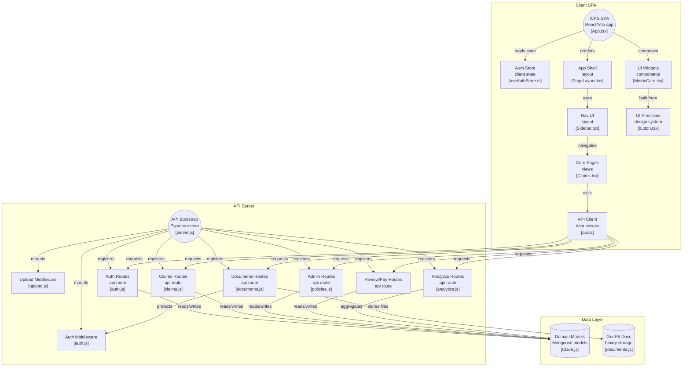

# ICPS Enterprise | Insurance Claim Processing System

[](https://dbms-icps-18366885i-sujithms-projects.vercel.app/login)
[](https://github.com/sujith0613/DBMS_ICPS)
[](LICENSE)
[](https://github.com/sujith0613/DBMS_ICPS)

**ICPS (Insurance Claim Processing System)** is a mission-critical, enterprise-grade full-stack application designed to modernize the insurance claim lifecycle. It bridges the gap between policyholders, surveyors, and administrators with a seamless, role-based workflow.

---

##  Architecture Diagram

The following diagram (generated via [GitDiagram](https://gitdiagram.com) API) visualizes the system architecture:



##  Features

###  Enterprise Design System
- **Linear/Stripe Aesthetics**: A premium UI built with high-performance Vanilla CSS.
- **Micro-interactions**: Smooth transitions and hover effects for a delightful user experience.
- **Responsive Layout**: Designed for tablets and desktops, providing clarity at every resolution.

###  Advanced RBAC (Role-Based Access Control)
- **Policyholder**: Smart claim filing wizard, real-time status tracking, and document management.
- **Admin**: Strategic overview, system-wide analytics, and administrative management.
- **Branch Manager**: Localized oversight and claim approvals.
- **Surveyor**: On-ground assessment tools and recommendation engine.
- **Service Provider**: Integration with hospitals/workshops for service verification.

###  Secure Document Management
- **MongoDB GridFS**: Industrial-strength storage for claim attachments (images, PDFs).
- **Infinite Scalability**: Avoids file system limitations by storing binary data directly in the database.
- **JWT-Protected Access**: Only authorized users can view sensitive documents.

###  Business Intelligence
- **Real-time Analytics**: Built-in Recharts integration for claim volume and approval metrics.
- **Financial Precision**: Uses `Decimal128` for all currency calculations to prevent floating-point errors.

---

##  Technology Stack

| Layer | Technologies |
| :--- | :--- |
| **Frontend** | React 19, TypeScript, Vite, TanStack Query, Recharts, Lucide, Sonner |
| **Backend** | Node.js, Express, JWT (HttpOnly Cookies), Multer |
| **Database** | MongoDB (Mongoose), GridFS for Large File Storage |
| **Styling** | Vanilla CSS (CSS Variables, Flexbox/Grid, Glassmorphism) |

---

##  Getting Started

Follow these steps to set up the project locally.

### 1. Prerequisites
- **Node.js**: v18 or higher.
- **MongoDB**: A running instance (local or Atlas).
- **Git**: Installed and configured.

### 2. Clone the Repository
```bash
git clone https://github.com/sujith0613/DBMS_ICPS.git
cd DBMS_ICPS
```

### 3. Server Configuration
```bash
cd server

# Install dependencies
npm install

# Setup Environment Variables (Optional)
# Create a .env file if you wish to override defaults:
# PORT=5000
# MONGODB_URI=mongodb://localhost:27017/icps_enterprise
# JWT_SECRET=your_secret_key

# Run the server
npm run dev
```

### 4. Client Configuration
```bash
cd ../client

# Install dependencies
npm install

# Run the development server
npm run dev
```

The application will be live at `http://localhost:5173`.

---

##  Demo Access

Explore the system using these pre-configured credentials (password: `password`):

| Role | Email | Best For... |
| :--- | :--- | :--- |
| **Admin** | `admin@icps.com` | High-level analytics and user management |
| **Policyholder** | `arjunkumar@gmail.com` | Filing new claims and viewing status |
| **Surveyor** | `rajesh@icps.com` | Reviewing evidence and providing estimates |
| **Provider** | `apollo@hospital.com` | Hospital/Service-side claim verification |

---

##  Project Architecture

```text
├── client/              # React Frontend (Vite)
│   ├── src/
│   │   ├── components/  # Atomic UI components
│   │   ├── pages/       # Feature-driven pages
│   │   ├── lib/         # Utility functions & API clients
│   │   └── index.css    # Global design system
└── server/              # Node.js + Express Backend
    ├── models/          # Data schemas (Policy, Claim, User)
    ├── routes/          # RESTful API endpoints
    ├── middleware/      # Auth & GridFS logic
    └── database.js      # MongoDB connection setup
```

---

##  License

This project is licensed under the MIT License - see the [LICENSE](LICENSE) file for details.

---
